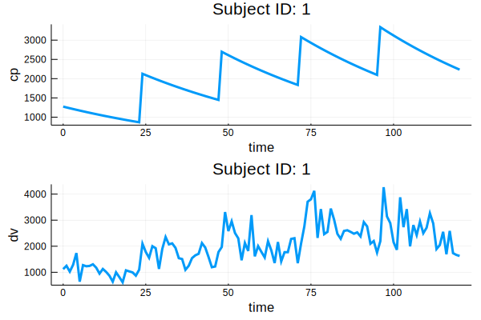
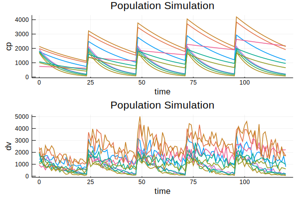
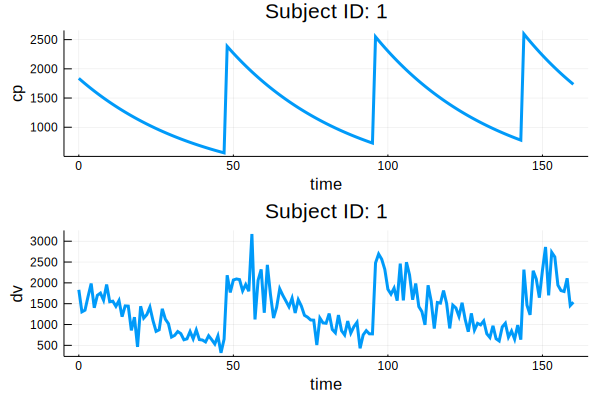

# Pumas.jl

[](https://gitlab.com/PumasAI/Pumas-jl/commits/master)
[](https://codecov.io/gh/PumasAI/Pumas.jl)

Pumas: A Pharmaceutical Modeling and Simulation toolkit

## Resources
  * [Downloads & Install Instructions](https://pumas.ai/download)
  * [Documentation](https://docs.pumas.ai/dev/)
  * [Tutorials](https://tutorials.pumas.ai/)
  * [Blog](https://pumas.ai/blog)
  * [Discourse Forum](https://discourse.pumas.ai/)

## Demo: A Simple PK model

```julia
using Pumas, Plots
```

For reproducibility, we will set a random seed:

```julia
using Random
Random.seed!(1)
```

A simple one compartment oral absorption model using an analytical solution

```julia
model = @model begin
  @param   begin
    tvcl ∈ RealDomain(lower=0)
    tvv ∈ RealDomain(lower=0)
    pmoncl ∈ RealDomain(lower = -0.99)
    Ω ∈ PDiagDomain(2)
    σ_prop ∈ RealDomain(lower=0)
  end

  @random begin
    η ~ MvNormal(Ω)
  end

  @covariates wt isPM

  @pre begin
    CL = tvcl * (1 + pmoncl*isPM) * (wt/70)^0.75 * exp(η[1])
    V  = tvv * (wt/70) * exp(η[2])
  end

  @dynamics ImmediateAbsorptionModel
    #@dynamics begin
    #    Central' =  - (CL/V)*Central
    #end

  @derived begin
      cp = @. 1000*(Central / V)
      dv ~ @. Normal(cp, sqrt(cp^2*σ_prop))
    end
end
```

Develop a simple dosing regimen for a subject

```julia
ev = DosageRegimen(100, time=0, addl=4, ii=24)
s1 = Subject(id=1,  evs=ev, cvs=(isPM=1, wt=70))
```

Simulate a plasma concentration time profile

```julia
param = (
  tvcl = 4.0,
  tvv  = 70,
  pmoncl = -0.7,
  Ω = Diagonal([0.09,0.09]),
  σ_prop = 0.04
  )
obs = simobs(model, s1, param, obstimes=0:1:120)
plot(obs)
```



Generate a population of subjects

```julia
choose_covariates() = (isPM = rand([1, 0]),
              wt = rand(55:80))
pop_with_covariates = Population(map(i -> Subject(id=i, evs=ev, cvs=choose_covariates()),1:10))
```

Simulate into the population

```julia
obs = simobs(model, pop_with_covariates, param, obstimes=0:1:120)
```
and visualize the output

```julia
plot(obs)
```


Let's roundtrip this simulation to test our estimation routines

```julia
simdf = DataFrame(obs)
simdf.cmt .= 1
first(simdf, 6)
```
Read the data in to Pumas

```julia
data = read_pumas(simdf, time=:time, cvs=[:isPM, :wt])
```

Evaluating the results of a model fit goes through an `fit` --> `infer` --> `inspect` --> `validate` cycle

### `fit`

```julia
julia> res = fit(model,data,param,Pumas.FOCEI())
FittedPumasModel

Successful minimization:                true

Likelihood approximation:        Pumas.FOCEI
Objective function value:           8190.106
Total number of observation records:    1210
Number of active observation records:   1210
Number of subjects:                       10

---------------------
           Estimate
---------------------
tvcl        4.9427
tvv        64.223
pmoncl     -0.69504
Ω₁,₁        0.10994
Ω₂,₂        0.11721
σ_prop      0.039982
---------------------
```

### `infer`

`infer` provides the model inference


```julia
julia> infer(res)
Calculating: variance-covariance matrix. Done.
FittedPumasModelInference

Successful minimization:                true

Likelihood approximation:        Pumas.FOCEI
Objective function value:           8190.106
Total number of observation records:    1210
Number of active observation records:   1210
Number of subjects:                       10

---------------------------------------------------------------
          Estimate         RSE                  95.0% C.I.
---------------------------------------------------------------
tvcl       4.9427       16.161          [ 3.3771  ;  6.5084  ]
tvv       64.223        10.886          [50.52    ; 77.925   ]
pmoncl    -0.69504      -8.4551         [-0.81022 ; -0.57986 ]
Ω₁,₁       0.10994      41.122          [ 0.021329;  0.19854 ]
Ω₂,₂       0.11721      35.581          [ 0.035468;  0.19894 ]
σ_prop     0.039982      4.2913         [ 0.036619;  0.043344]
---------------------------------------------------------------
```

### `inspect`

`inspect` gives you the model predictions, residuals and Empirical Bayes estimates

```julia
resout = DataFrame(inspect(res))
```

```julia
julia> first(resout, 6)
6×12 DataFrame
│ Row │ id     │ time    │ isPM  │ wt    │ dv_pred │ dv_ipred │ pred_approx │ dv_wres     │ dv_iwres  │ wres_approx │ ebe_1                │ ebes_approx │
│     │ String │ Float64 │ Int64 │ Int64 │ Float64 │ Float64  │ Pumas.FOCEI │ Float64     │ Float64   │ Pumas.FOCEI │ Array{Float64,1}     │ Pumas.FOCEI │
├─────┼────────┼─────────┼───────┼───────┼─────────┼──────────┼─────────────┼─────────────┼───────────┼─────────────┼──────────────────────┼─────────────┤
│ 1   │ 1      │ 0.0     │ 1     │ 74    │ 1436.35 │ 1813.1   │ FOCEI()     │ -0.00953274 │ -1.05809  │ FOCEI()     │ [0.344171, -0.20779] │ FOCEI()     │
│ 2   │ 1      │ 1.0     │ 1     │ 74    │ 1418.4  │ 1741.66  │ FOCEI()     │ 0.0688445   │ -0.85222  │ FOCEI()     │ [0.344171, -0.20779] │ FOCEI()     │
│ 3   │ 1      │ 2.0     │ 1     │ 74    │ 1399.64 │ 1673.04  │ FOCEI()     │ 0.270273    │ -0.476807 │ FOCEI()     │ [0.344171, -0.20779] │ FOCEI()     │
│ 4   │ 1      │ 3.0     │ 1     │ 74    │ 1380.15 │ 1607.12  │ FOCEI()     │ 0.87765     │ 0.390877  │ FOCEI()     │ [0.344171, -0.20779] │ FOCEI()     │
│ 5   │ 1      │ 4.0     │ 1     │ 74    │ 1360.02 │ 1543.8   │ FOCEI()     │ 0.76586     │ 0.563797  │ FOCEI()     │ [0.344171, -0.20779] │ FOCEI()     │
│ 6   │ 1      │ 5.0     │ 1     │ 74    │ 1339.34 │ 1482.97  │ FOCEI()     │ -0.393821   │ -0.450252 │ FOCEI()     │ [0.344171, -0.20779] │ FOCEI()     │
```

### `validate` - `vpc`

Finally validate your model with a visual predictive check

```julia
vpc(res) |> plot
```


or you can do a `vpc` into a new design as well.

Plotting methods on model diagnostics are coming soon.

### Simulate from fitted model

In order to simulate from a fitted model `simobs` can be used. The final parameters of the fitted models are available in the `coef(res)`

```julia
fitparam = coef(res)
```

You can then pass these optimized parameters into a `simobs` call and pass the same dataset or simulate into a different design

```julia
ev_sd_high_dose = DosageRegimen(200, time=0, addl=4, ii=48)
s2 = Subject(id=1,  evs=ev_sd_high_dose, cvs=(isPM=1, wt=70))
```

```julia
obs = simobs(model, s2, fitparam, obstimes=0:1:160)
plot(obs)
```


## Visualization

There are several plot recipes you can use to visualize your model fit.  These are mainly provided by the [`PumasPlots.jl`](https://github.com/PumasAI/PumasPlots.jl) package (currently unregistered, add via URL).

PumasPlots provides recipes to visualize `FittedPumasModel`s, and also has powerful grouping functionality.  While some plot types are specialized for fitted models, you can use all of Plots' features by converting your result to a DataFrame (using `DataFrame(inspect(res))`).

- `convergence(res::FittedPumasModel)` - plots the optimization trajectory of all variables.
    ```julia
    convergence(res)
    ```
    

- `etacov(res::FittedPumasModel)` - plots the covariates of the model against the etas.  Keyword arguments are described in the docstring - essentially, you can use any column in `DataFrame(inspect(res))` to plot.  
    ```julia
    etacov(res; catmap = (isPM = true,))
    ```
    


- `resplot(res::FittedPumasModel)` - plots the covariates of the model against their residuals, determined by the approximation type.  Accepts many of the same kwargs as `etacov`.
    ```julia
    resplot(res; catmap = (isPM = true,))
    ```
        

- `corrplot(empirical_bayes(res); labels)` - overload of the `StatsPlots` corrplot, for etas.
    ```julia
    corrplot(empirical_bayes(res); labels = ["eta_1", "eta_2"])
    ```
    

Most of these plotting functions have docstrings, which can be accessed in the REPL help mode by `>? resplot` (for example).

In addition to these specialized plots, PumasPlots offers powerful grouping functionality.  By working with the DataFrame of your results (`DataFrame(inspect(res))`), you can create arbitrary plots, and by using the `plot_grouped` function, you can create panelled (a.k.a. grouped) plots.

```julia
df = DataFrame(inspect(res))
gdf = groupby(df, :isPM) # group by categorical covariate

plot_grouped(gdf) do subdf # `plot_grouped` will iterate through the groups of `gdf`
    boxplot(subdf.wt, subdf.wres; xlabel = :wt, ylabel = :wres, legend = :none) # you can use any arbitrary plotting function here
end
```

